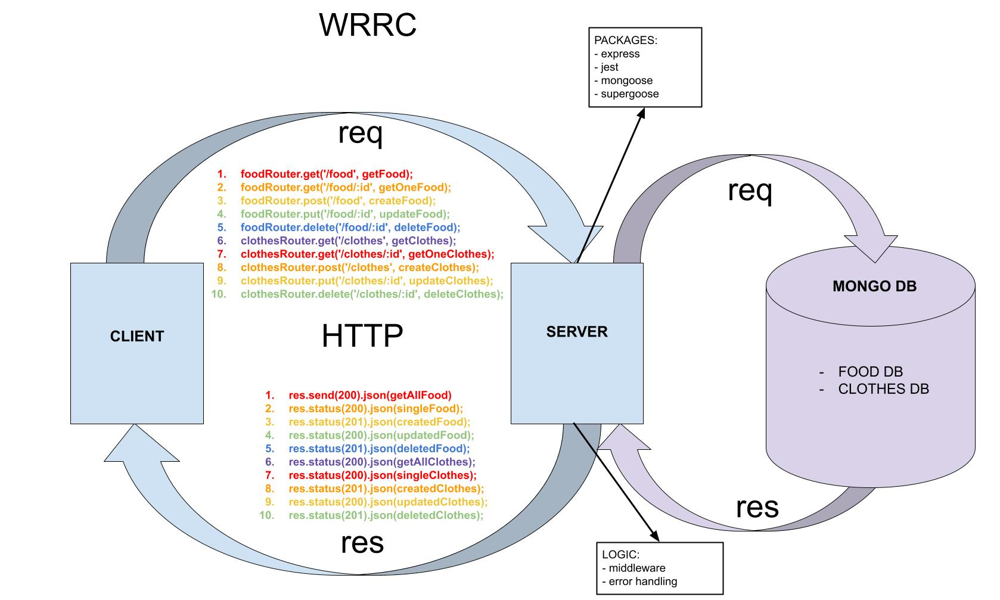

# Lab 04 - 401 JavaScript

# API Server

## Author: Lydia Minehan-Tubic

### Links and Resources

✨ [Products Route](https://lydia-api-server.herokuapp.com/products)

✨ [TODO Route](https://lydia-api-server.herokuapp.com/todo)

✨ [Food Route](https://lydia-api-server.herokuapp.com/food)

✨ [Clothing Route](https://lydia-api-server.herokuapp.com/clothes)

✨ [GitHub Actions](https://github.com/LydiaMT/api-server/actions)


### Setup

- Clone down to your device
- In the root directory, run `npm install` to install node modules
- Run `nodemon` to see your live server via local host in your browser.

### Use

- Uses MongoDB. You can add items to the database via a mock API service, like [Swagger](https://inspector.swagger.io/builder)
- Routes include `/food` and `/clothes`

### To add a food object, use the following data shape:
```JS
// to create or update an object...
{ "name": "pizza", "calories": "9999", "type": "FRUIT" }
// "name" must be entered as a string, and "calories" as a number. 
// "type" includes: 'FRUIT', 'VEG', 'PROTEIN', 'STARTCH', 'SNACK'

// This is how the object appears in the database once an ID is added:
[
    {
        "_id": "608213af8aa0de435955e12b",
        "name": "pizza",
        "calories": 9999,
        "type": "FRUIT",
        "__v": 0
    }
]
// Once an item is added, you can update or delete 
// it by appending it's unique id to the food route, such as 
// `.../food/608213af8aa0de435955e12b`
```

### To add a clothing object, use the following data shape. 

```JS
// to create or update an object...
{ "size": "9", "color": "blue", "type": "SHIRT" }
// "size" must be entered as a number, and "color" as a string. 
// "type" includes: 'SHIRT', 'PANTS', 'SHORTS', 'DRESS', 'JACKET'

// This is how the object appears in the database once an ID is added:
[
    {
        "_id": "608214a88aa0de435955e12e",
        "size": 9,
        "color": "white",
        "type": "SHIRT",
        "__v": 0
    }
]
// Once an item is added, you can update or delete 
// it by appending it's unique id to the clothing route, 
// such as `.../clothes/608214a88aa0de435955e12e`
```

### Test

In the command line at the root directory, `run npm test` to make sure all test are passing as expected.

### Architecture

```git
├── .gitignore
├── .eslintrc.json
├── __tests__
│   ├── server.test.js
│   ├── logger.test.js
├── src
│   ├── error-handlers
│   │   ├── 404.js
│   │   ├── 500.js
│   ├── middleware
│   │   ├── logger.js
│   │   ├── validator.js
│   ├── models
│   │   ├── food.js
│   │   ├── clothes.js
│   │   ├── data-collection-class.js
│   ├── routes
│   │   ├── food.js
│   │   ├── clothes.js
│   ├── server.js
├── index.js
└── package.json
```

### UML / WRRC



### Contributions 

Thank you to Jarrell Houston for guidance and debugging tips

[Notes on Atlas MongoDB Intigration](https://github.com/codefellows/seattle-301d72/blob/master/README.md)
